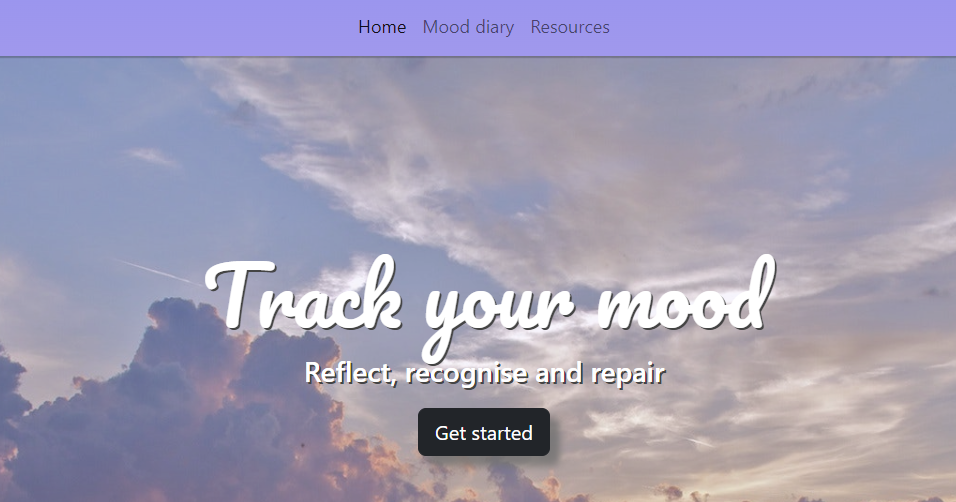
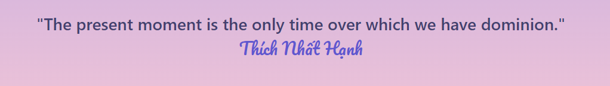
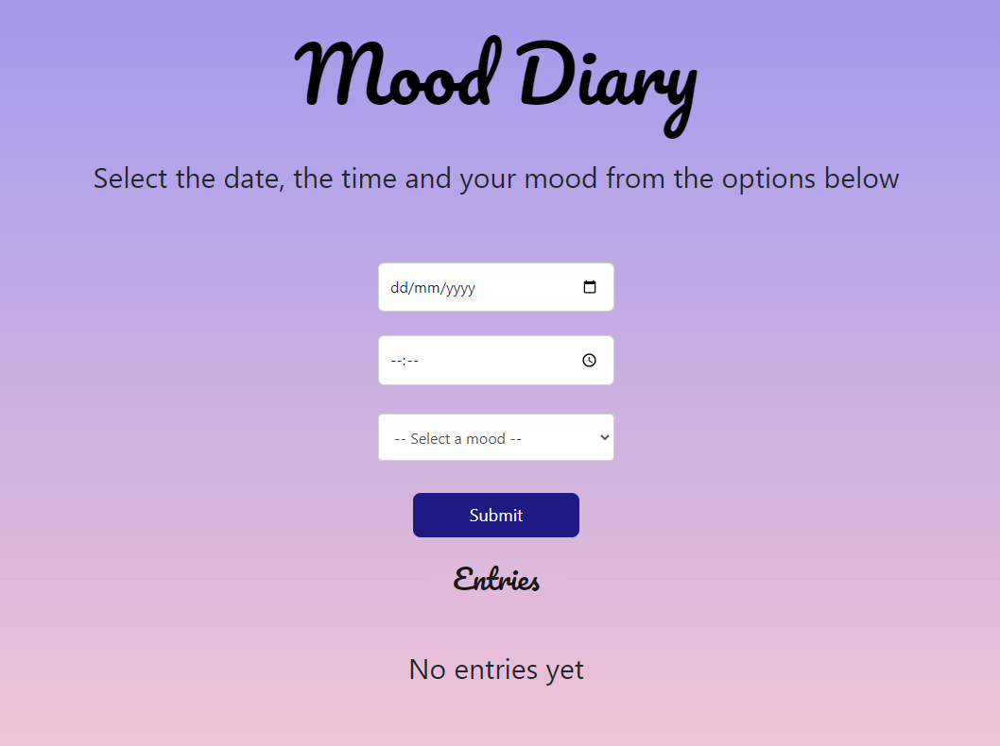
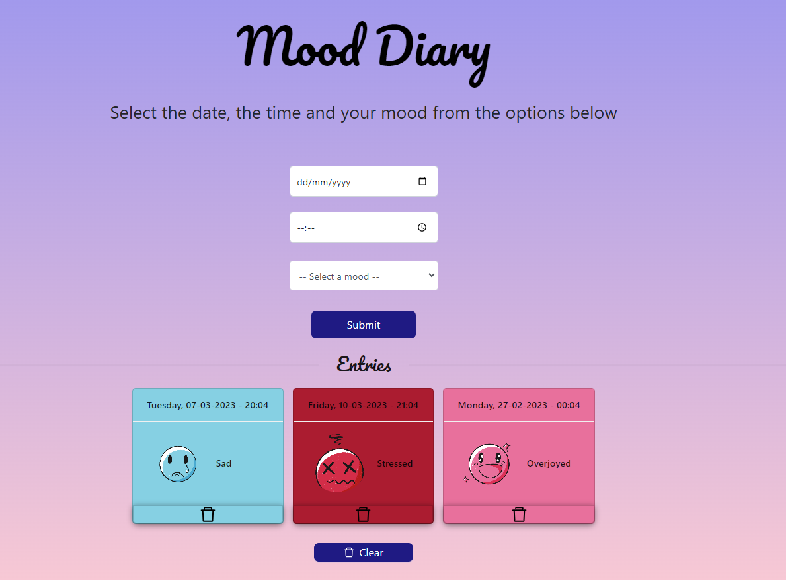
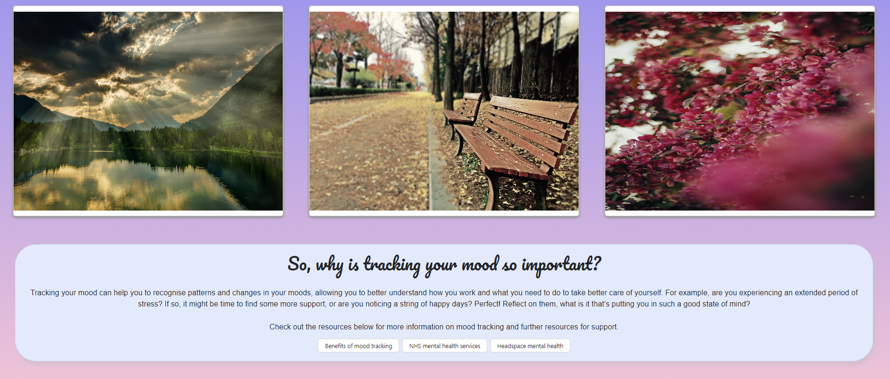

# <Mood-tracker>

## Description

This project was an opportunity for us to work collaboratively as a group in order to create a React application. Our project requirements were to create a React application that utilised node.js, was a single page application and used technologies/packages that we hadn't used prior to this project.

For our project idea, we ended up creating a mood diary application, wherein the user can track their daily moods, in order to better regulate and understand their emotions. The application uses React Router to create multiple "pages" on screen - a Homepage, Mood Dairy and Resources.

As such this was a really exciting project for our group, not only had we not all worked together before so had to spend some time getting used to each other's ways of working, but it gave us the opportunity to look into documentation for new technologies. We ended up utilising Framer Motion and Ant Design as our "new" packages, as well as using a MetaAPI Mindfullness Quote API and the Pexels image API to create dynamically changing content.

## Table of Contents

- [Installation](#installation)
- [Usage](#usage)
- [Credits](#credits)
- [License](#license)

## Installation

The project can be viewed [here](https://sparkling-bonbon-353948.netlify.app/)  

However, to clone the programme and run locally, a react app will need to be built on the local device.

## Usage

Accessing the deployed application will first take the user to the home page, where they will be presented with a navigation bar, a jumbotron - containing the app name, subheading and a get started button, as shown in the image below:  

  

Beneath the jumbotron shown above, the user will also see a quote on screen - this will change ever 12 seconds as the quote api fetches at intervals. Each new quote will animate onto the screen, thanks to framer motion components:  

  

The user has two ways to navigate away from the home page, either using the navbar at the top of the page or by selecting the "Get Started" button on the home page jumbotron as shown below. Selecting "Get Started" will take them to the mood diary page as shown below:  

  

In the screenshot below you can see what the screen will look like for a new user. No moods have been previously recorded, as a result the enteries section of the page is empty. However if the user begins entering their moods in the form at the top of the page, these moods will be saved in local storage and pushed onto the page as cards, as shown below:  

As you can see the mood diary cards have their own themeing and icon depending on the mood selected, they also show the date, time and name of the mood. Each card also has it's own individual delete button - incase a user wishes to delete an individual card, or they can use the clear button at the bottom of the page to delete all stored cards.

Finally, users can navigate to the Resources page as shown below:  

  

On this final page, the user can see three image cards, which periodically change to different images - these are pulled from the pexels api. These images are specifically set up to show chilled, calming images based on pre-chosen image results. At the bottom of the resources page if a small section of text that explains to the user the purpose of mood tracking and its benefits. They can also find button links to external resources to help with their mental health.

## Credits

Collaborators:  
- [Dumisile](https://github.com/DumisileM)  
- [Sonia](https://github.com/Sonia-deni)  
- [Puspita](https://github.com/PuspitaGoswami)  
- [Emma](https://github.com/EmH93)  

Resources:  
- [AntDesign](https://ant.design/)  
- [Framer Motion](https://www.framer.com/motion/)  
- [MetaAPI Mindfulness Quotes](https://rapidapi.com/unfied-inc-unfied-inc-default/api/metaapi-mindfulness-quotes)
- [Pexels API](https://www.pexels.com/api/)  
- [Bootstrap](https://getbootstrap.com/)

## License

  
MIT license

